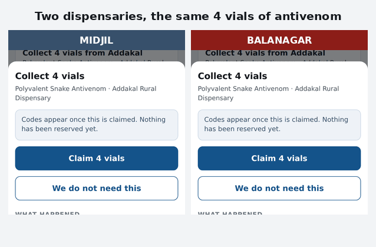

# Rural Vet Medicine Expiry & Emergency Swap Board

Expensive cattle anti-venom and foot-and-mouth vaccine expire on the shelf in one
village dispensary while the next village runs short during an outbreak. This is a
board where rural livestock assistants flag expiring batches, post urgent
shortages, and confirm the physical handoff between two clinics.

Built for a livestock assistant on a cheap Android phone, outdoors, on 2G,
during an outbreak. Every trade-off below follows from that sentence.

- **Live app:** [sidproject-zeta.vercel.app](https://sidproject-zeta.vercel.app)
- **Trade-off memo:** [`MEMO.md`](./MEMO.md)
- **Where AI is used, and where it isn't:** [`docs/ai-design.md`](docs/ai-design.md)
- **The brief:** [`docs/brief/`](./docs/brief/)

---

## Run it in five minutes

You need Node 22+. **You do not need a Supabase account to run or test this** —
see [Run it with no account](#run-it-with-no-account-at-all) below.

```bash
git clone https://github.com/manideep1799/sidproject.git
cd sidproject
npm install
```

### 1. Create a free Supabase project

At [supabase.com/dashboard](https://supabase.com/dashboard) → **New project**.
Any region; the free plan is enough.

### 2. Load the schema and the seed

Open the project's **SQL Editor** and run these four files in order, top to bottom:

| Order | File | What it does |
|---|---|---|
| 1 | `supabase/migrations/0001_schema.sql` | Tables, indexes, the derived-stock view |
| 2 | `supabase/migrations/0002_functions.sql` | Login, claim arbitration, TTL sweep, handoff |
| 3 | `supabase/migrations/0003_rls.sql` | Row-level security and grants |
| 4 | `supabase/seed.sql` | 6 dispensaries, drug catalogue, stock, contested batch |

Run `0003` last: it closes the schema to `PUBLIC` and then opens exactly the API
surface, so it has to see every function that already exists.

### 3. Point the app at it

**Settings → API** gives you the Project URL and the `anon` public key.

```bash
cp .env.example .env
# edit .env:
#   VITE_SUPABASE_URL=https://<your-ref>.supabase.co
#   VITE_SUPABASE_ANON_KEY=<anon key>
npm run dev
```

Open the printed URL. Sign in with any clinic below.

### 4. Deploy

Import the repo at [vercel.com/new](https://vercel.com/new). Vite is detected
automatically; `vercel.json` is already here. Add the same two variables under
**Settings → Environment Variables** and deploy.

> **Keep the demo alive.** Supabase pauses a Free Plan project after **7 days**
> without database activity, and a paused project needs a manual restore from
> the dashboard — it does not wake on a request. `.github/workflows/keep-warm.yml`
> pings it every three days; add `SUPABASE_URL` and `SUPABASE_ANON_KEY` as
> repository secrets to switch it on.

---

## Demo clinics

The PINs are also listed on the sign-in screen, so nobody has to go hunting.

| Code | Dispensary | PIN | Why it is interesting |
|---|---|---|---|
| `MBNR` | Mahabubnagar | `1234` | The hub. FMD vaccine expiring in 9 days |
| `ADKL` | Addakal | `2345` | **Holds the contested 4 vials of antivenom** |
| `JDCL` | Jadcherla | `3456` | Has a quarantined broken-cold-chain batch |
| `DVKD` | Devarakadra | `4567` | 18 km out; FMD expiring in 3 days |
| `BLNG` | Balanagar | `5678` | **Offered the antivenom.** Has an open outbreak request |
| `MDJL` | Midjil | `6789` | **Also offered the same antivenom.** 34 km — needs a cold box |

Distances are real. The clinics sit 13–34 km apart in Mahabubnagar district,
Telangana, so the radius filter and the cold-box threshold both actually bite.

## The double-claim and the offline queue, in 15 seconds



Judging criteria #1 and #2 — the matching/handoff workflow and edge-case
handling — are what the video is of. Try both yourself below; they're real, not staged.

## The board thinks ahead

Two kinds of intelligence, each where it is the right tool:

**It proposes transfers nobody asked for.** The ledger is a complete time series
of demand, so the app forecasts which batches will expire unused and which
clinics will run out, then pairs the two. In the seeded district Jadcherla holds
48 FMD vials expiring in 27 days and barely uses FMD; Balanagar gets through
about one a day and is nearly out; they are 13 km apart. Sign in as `BLNG` and
the Requests tab already says **"Ask Jadcherla for 19 vials"** — with both halves
of the reasoning shown, and marked a prediction rather than a fact. No request
was posted; it's a suggestion, not an action, until a worker taps it. Sign in as
`JDCL` instead and the same pairing shows its other half: **"Offer 19 vials to
Balanagar"**, one tap away from a real proposed transfer through the same
`propose_transfer` path a manual offer would use. Deterministic, offline, zero
cost — only the tap itself needs a connection.

**It reads plain speech, in English or Telugu.** *"20 vials FMD vaccine, two
herds down at Peddapur"* becomes a filled-in draft the worker checks and posts.
Optional: without an API key the manual form is untouched and everything else
works. See [`docs/ai-design.md`](docs/ai-design.md).

## Two things worth trying first

**The double-claim (60 seconds).** Sign-in is a clinic PIN kept in
`localStorage`, which every regular tab and window on a browser shares — so
open one **normal** window and one **Incognito / Private** window, not two
regular tabs, or the second one just shows the first clinic already signed in.
Sign in as `BLNG` in one and `MDJL` in the other. Both go to **Transfers** →
the antivenom card says *Claim 4 vials*. Tap it in one window, then the other.
One gets six-digit handoff codes. The other is told **"Already committed to …
just now"** — who won and when, not a failure code.

**The offline queue (30 seconds).** Sign in anywhere, scroll to **Demo controls**,
tap **Cut the connection**. Record use of a batch — it saves, because your own
shelf is nobody else's business. The strip says *waiting to send*, never
*confirmed*. Tap **Go back online** and watch it drain. Now try claiming stock
while offline: it queues as *Waiting to send* and stays that way, because a claim
is a race and no device may decide a race on its own.

---

## Testing

Everything runs locally with no Supabase account and no network.

```bash
npm test          # 188 unit tests — ledger, state machine, matching, forecast, outbox
npm run test:db   # schema, RPCs, RLS probes against a throwaway Postgres 16
npm run test:race # + five clinics claiming the same 4 vials simultaneously
npm run test:e2e  # + the whole app in headless Chromium at 360px
npm run typecheck
```

`test:db` spins up its own Postgres, applies the migrations verbatim, seeds, then
asserts 87 behaviours including 13 hostile probes of what a browser holding the
anon key can do. `test:e2e` adds a PostgREST-compatible shim
(`scripts/local-api.mjs`) so the real UI runs against a real database.

Postgres 16 binaries are needed for the database tests; set `PGBIN` if they are
not at `/usr/lib/postgresql/16/bin`.

---

## How it is put together

```
src/domain/     Pure. No React, no Supabase, no clock. All the unit tests live here.
   ledger.ts      on-hand = SUM(delta); idempotent merge; server-time ordering
   transfer.ts    (state, event) => state, total over its event set
   matching.ts    haversine, filter, rank, the "why" string, partial fulfilment
   forecast.ts    consumption rate, waste + stockout outlook, confidence
   anticipate.ts  pairs predicted waste against predicted stockout
   intake.ts      validates model output before a human ever sees it
   expiry.ts      bands, plain language, staleness
   outbox.ts      contested vs uncontested, and what the UI may claim
src/data/       Adapters only. IndexedDB, fetch, session, the drain loop.
src/ui/         React. Presentation and wiring; no rules of its own.
api/            Serverless. Holds the model key; never reaches the browser.
supabase/       Migrations, seed, and the server-side test suite.
scripts/        test-db.sh, race-test.sh, e2e.sh, local-api.mjs
```

The separation is load-bearing, not decorative: `src/domain` has no imports from
`react` or the network, which is why the interesting logic can be tested in
milliseconds and why the same rules hold whether an action arrives online, from
the offline queue, or on replay.

### The one decision everything else follows from

There is no `qty_on_hand` column. On-hand is `SUM(delta)` over an append-only
ledger.

Two field workers, both with no signal, both dispense 5 vials from the same
batch. With a stored total, each device writes `qty = 7` and the last write wins:
five vials vanish silently. With deltas, both rows survive and the answer is
`12 − 5 − 5 = 2`. Deltas commute, so merge order cannot change the result;
absolute totals do not, and an app that overwrites one has already destroyed the
information needed to merge.

Everything else — the locked claim transaction, the honest pending states, the
dual codes — exists to protect that property at the edges.

---

## Deliberate deviations from the spec

Each is argued at the point it occurs in the code.

| Deviation | Why |
|---|---|
| Dropped `@supabase/supabase-js` for `fetch` | The SDK was 100 KB gzipped of a 125 KB bundle; the whole surface used was `.rpc()` and `select/order/limit`. Bundle is now 71.8 KB — about four seconds off first load on 2G. Same argument the spec makes about webfonts. |
| Opaque server session token, not a "signed clinic id" | A static deploy has nowhere to keep a signing secret, so it would have been signed with a key in the bundle. `clinic_sessions` gives the same guarantee and is actually enforceable. |
| Broken cold chain excludes a batch from matching | A vaccine that arrives inert is worse than none: the herd goes on the register as protected. Separately, `needsColdBox` flags cold-chain stock travelling past 25 km without filtering it. |
| `planFulfilment` across multiple clinics | `partially_filled` was already in the request enum, and real shortages get filled 12 vials from one neighbour and 8 from the next. |
| PIN lockout after 5 wrong tries | A 4-digit PIN is 10,000 combinations. The brief mandates the PIN; it does not mandate leaving it open. |
| Polling, not Realtime | A held websocket costs battery and data on a handset idle in a drawer. |

## Not built, on purpose

Maps and routing, photo uploads, push notifications, SMS/IVR, multi-language,
admin analytics, real identity verification, temperature-sensor integration,
inter-clinic payment, and roles below clinic level. Each is out of scope in the
brief; [`MEMO.md`](./MEMO.md) says what it would cost to add the ones that matter.
